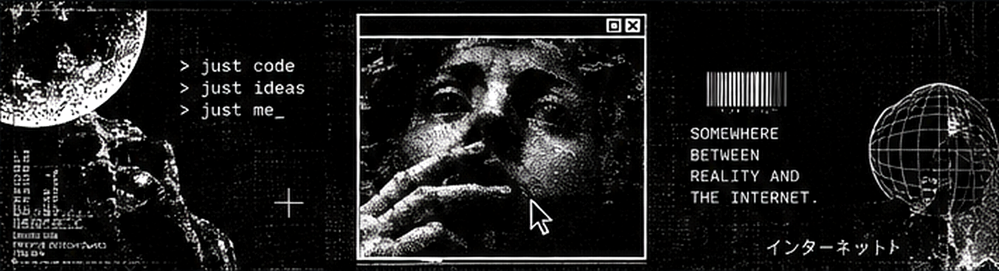

<p align="center">
  
</p>

<p align="center">
  <sub><code>same human, different internet</code></sub>
</p>

<br>

## About

I'm **Davi Gabriel**, a web developer focused on building interfaces that feel alive.

I’m especially interested in **front-end**, **UI**, **creative digital experiences**, and the space where **design + code** meet.  
My visual references often come from the strange side of the internet — **webcore**, **cybergrunge**, **Y2K**, **old web**, dark editorial design, and experimental aesthetics.

I like creating things that feel intentional, memorable, and a little different from the ordinary.

> *The web should feel strange again.*

---

## Connect

<p align="left">
  <a href="https://github.com/mendeszk25">
    
  </a>
  <a href="https://www.instagram.com/mendeszk__/">
    
  </a>
</p>

---

## Tech Stack

<p align="left">
  
</p>

```txt
HTML / CSS / JavaScript / Git / GitHub / VS Code / Figma / Firebase / Supabase
