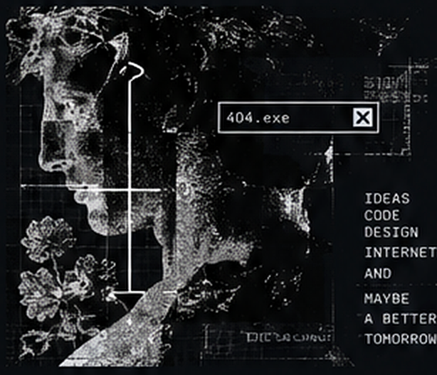

<div align="center">


<br>

# Hi, I’m Davi Gabriel

### Web Developer

`building digital experiences somewhere between code and chaos.`

</div>

---

## `01 // ABOUT ME`



I'm **Davi Gabriel**, a web developer focused on turning ideas into interfaces with personality.

I like combining **code, design and internet culture** to build websites that feel intentional instead of generic. My work lives somewhere between modern web development, old-web references, visual experimentation and clean usability.

I’m always building real projects, learning new tools and refining how design and development can work together.

<br>

```txt
> interface first.
> code with intent.
> make the web feel alive.
```

<br clear="right"/>

---

## `02 // CONNECT`

<div align="center">

<a href="https://github.com/mendeszk25">
  
</a>
&nbsp;&nbsp;
<a href="https://www.instagram.com/mendeszk__/">
  
</a>

</div>

---

## `03 // TECH STACK`

<div align="center">


</div>

---

## `04 // GITHUB STATS`

<div align="center">


</div>

---

## `05 // ACTIVITY GRAPH`

<div align="center">


</div>

---

<div align="center">

```txt
same internet. different mindset.
```

<sub>`mendeszk25 / build something cool.`</sub>

</div>
